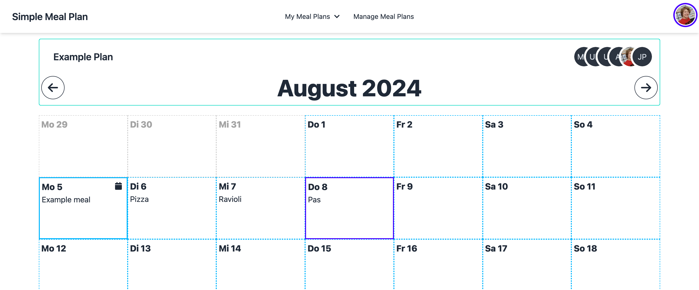

# Simple Meal Plan

This is a very simple meal planner. It's main purpose is to host it as a free SaaS solution.
You can use it [here](https://simple-meal-plan.app). Anyway you can deploy it using Docker.

I want to replace the Excel Sheet, my girlfriend was using.

## Features

- Plan Meal for any date
- (Tablet, Desktop): See a complete calendar of the month which is editable
- Share meal plans with magic links to other users to collaborate (household, etc.)
- Manage multiple meal plans per user

## Techstack

- [Next.js](https://nextjs.org)
- [Prisma](https://prisma.io)
- [Tailwind CSS](https://tailwindcss.com)
- [DaisyUI](https://daisyui.com)

## Deployment

You'll need a MySQL / MariaDB database.
Have a look at [`.env.example`](./.env.example) or at the [schema](./src/env/schema.mjs)
